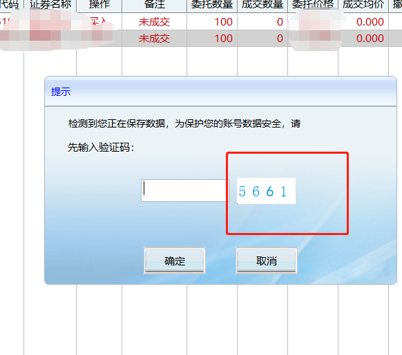
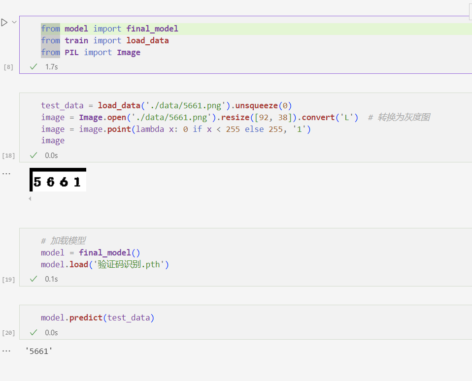
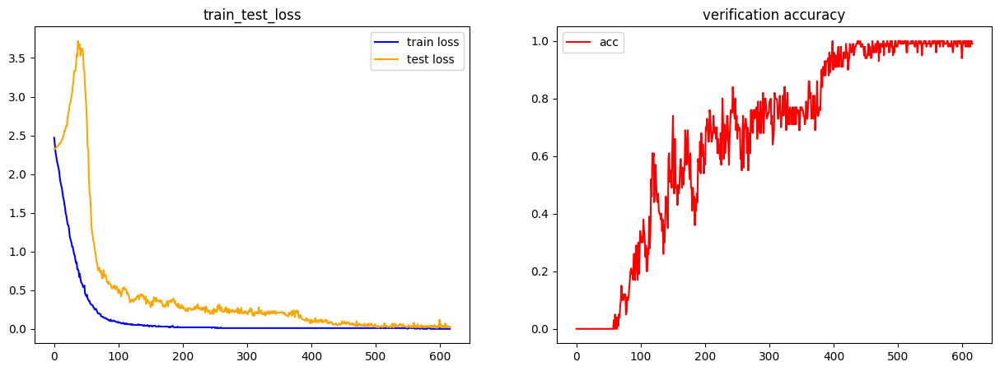

# 验证码OCR

#### 介绍
使用Resnet18识别同花顺验证码

#### 项目架构
data: 存放你的训练数据(建议存放1万张图片)

test_data: 存放你的测试数据

model.py: 网络架构

train.py: 网络训练架构

test.ipynb: 推理样例

验证码识别.pth: 已经保存好的resnet18模型参数

#### 训练步骤
1. 将同花顺二维码图片保存至data文件夹中: 


2. cd到当前项目目录, 终端运行以下代码
```python train.py```,训练结果会覆盖```验证码识别.pth```文件

#### 结果展示
您可以打开```test.ipynb```文件看到以下内容


训练损失与测试验集证码识别准确率: 


#### 设计训练架构的思考过程
设计损失函数时, 使用极大似然的思想来优化网络。所以在```train.py```文件中训练代码写的比较混乱。

不妨设验证码中每个数字为一个随机变量x，一串验证码记为一个随机向量

$$X_i=\{x_{i1}, x_{i2}, x_{i3}, x_{i4}\}$$

其中i可取1到10000的任意正整数（参与训练的样本数为10000条）。假设每条样本相互独立, 样本中每个字符相互独立, 每个字符在0到9上服从一个多项分布:

$$P_{\theta}(x_{ij}=k)=p_{ijk}$$

其中j取值1到4（一条样本二维码包含4个数字）, k取值0到9（每个数字可取0到9中的任意一个）, $\theta$为神经网络的参数。后续我们简记$P(x_{ij})$。我们可以写出一条样本的似然函数：

$$\prod_{j=1}^4P_{\theta}(x_{ij})$$

所以在所有样本上的似然函数为: 

$$L=\prod_{i=1}^{10000}\prod_{j=1}^4P_{\theta}(x_{ij})$$

对似然函数取负对数为```train.py```中的损失函数: 

$$loss=-\sum_{i=1}^{10000}\sum_{j=1}^4\log(P_{\theta}(x_{ij}))$$
